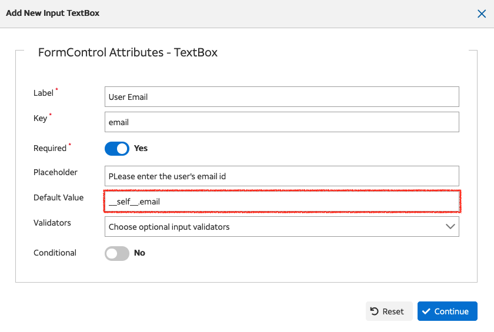

Form Implicit Variables
=======================

When designing a form, you may want to pre-fill certain form controls with data about the logged-in user. For example, you may want to pre-fill the email form control with the email address of the logged-in user. To achieve this,

CSS offers several implicit variables that can be used while designing a dynamic form. These variables provide information about the logged-in user and can be referenced directly in the form configuration.

__self__ Variable
-----------------

The `__self__` variable contains data about the logged-in user. Below is the structure of the `__self__` variable:

.. code-block:: json

    {
      "attUid": "ta147p",
      "firstName": "TOSLIM",
      "lastName": "ARIF",
      "profilePhoto": "https://avatar.z.att.com/microsoft/photo/ta147p@exo.att.com",
      "supervisorAttUid": "mc370a",
      "isSupervisor": false,
      "reports": "0,0",
      "level": "1",
      "hierarchy": "jm7555|ma5306|ct1409|ew9816|ln5767|bc2132|ms110b|mc370a|ta147p",
      "jtName": "SR SPECIALIST NETWORK DESIGN ENGINEERING",
      "consultingCompany": "",
      "contractorFlag": "N",
      "email": "ta147p@exo.att.com",
      "telephoneNumber": "+ 918043547352",
      "state": "KA",
      "country": "India",
      "userType": "Default"
    }

Each key in the `__self__` variable can be referenced in the form as follows:

- `attUid`: The unique identifier of the user.
- `firstName`: The first name of the user.
- `lastName`: The last name of the user.
- `profilePhoto`: The URL to the user's profile photo.
- `supervisorAttUid`: The unique identifier of the user's supervisor.
- `isSupervisor`: A boolean indicating if the user is a supervisor.
- `reports`: The number of reports the user has.
- `level`: The user's level in the organization.
- `hierarchy`: The user's hierarchy path.
- `jtName`: The job title of the user.
- `consultingCompany`: The consulting company of the user, if any.
- `contractorFlag`: A flag indicating if the user is a contractor.
- `email`: The email address of the user.
- `telephoneNumber`: The telephone number of the user.
- `state`: The state where the user is located.
- `country`: The country where the user is located.
- `userType`: The type of user.

Referencing Variables in Form Design
------------------------------------

While designing a form, you can reference these variables to set default values or pre-fill form controls. For example, to set the email form control with the logged-in user's email, you can use:

Using the UI

Using the Advanced JSON Editor

.. code-block:: json

    {
        "key": "email",
        "value": "__self__.email",
        "label": "User Email",
        "controlType": "textbox",
        "required": true,
        "hidden": false,
        "order": 1,
        "placeholder": "PLease enter the user's email id",
        "validator": "None",
        "conditions": null
    }

This will automatically populate the email form control with the email address of the logged-in user.
The user can then modify the email address if required.
There is also a provision to disable the form control if you do not want the user to modify the email address using the `readonly` attribute setting it to `true`.